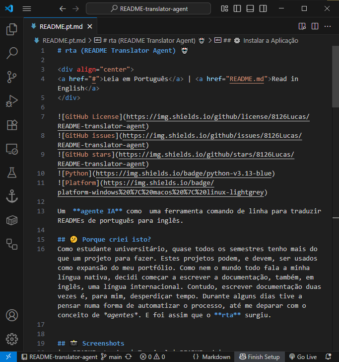
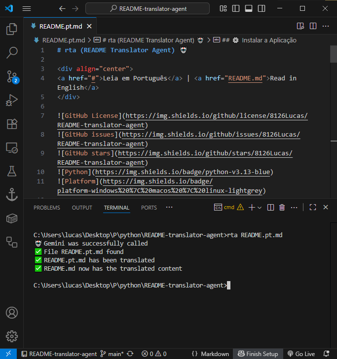
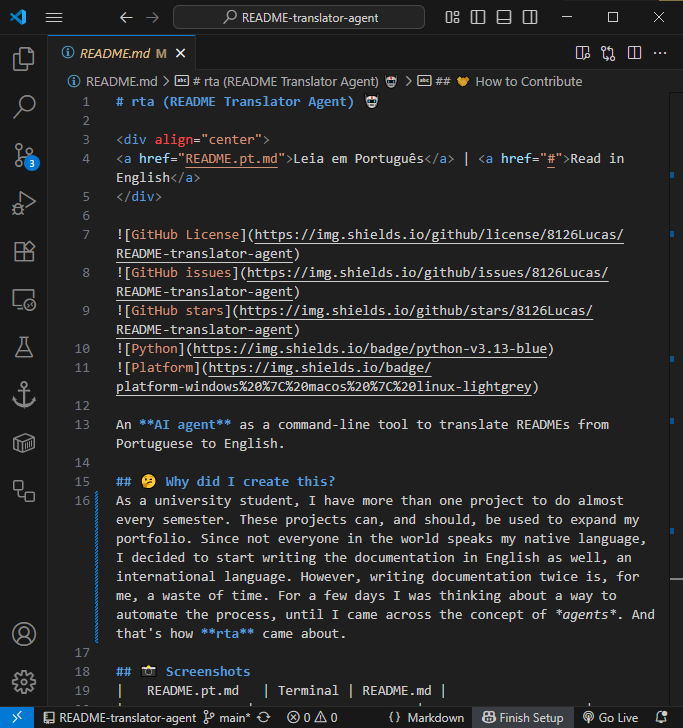

# rta (README Translator Agent) 🤖

<div align="center">
<a href="README.pt.md">Leia em Português</a> | <a href="#">Read in English</a>
</div>


An **AI agent** as a command-line tool to translate READMEs from Portuguese to English.

## 🤔 Why did I create this?
As a university student, almost every semester I have more than one project to do. These projects can, and should, be used as an expansion of my portfolio. As not everyone in the world speaks my native language, I decided to start writing the documentation in English as well, an international language. However, writing documentation twice is, for me, a waste of time. For a few days, I was thinking about a way to automate the process, until I came across the concept of *agents*. And that's how **rta** came about.

## 📸 Screenshots
|   README.pt.md   | Terminal | README.md |
|----------------|---------------------|---------------------|
|  |  |  |

## 📱 How it Works
1. Write in the `README.pt.md` file
2. Run the command `rta README.pt.md`
3. The `README.md` file is created/modified

## 😎 When to use `rta`?
- University projects that you want to share internationally
- Open-source code documentation
- Any project where you need documentation in two languages

## 📝 Example
**Before (README.pt.md):**
`## 🔧 Tecnologias Utilizadas`

**After (README.md):**
`## 🔧 Technologies Used`

## 🔧 Technologies Used
- **Python 3.13**: Python version used
- **Gemini 2.0 Flash**: AI model for text processing
- **Typer**: Python library for creating command-line interfaces
- **UV**: Python package manager

## ⚙️ Install the Application
1. Clone the repository:
```bash
git clone https://github.com/8126Lucas/README-translator-agent.git
```
2. Check if UV is installed:
```bash
uv --version

# If it is not installed
curl -LsSf https://astral.sh/uv/install.sh | less              # macOS and Linux
powershell -c "irm https://astral.sh/uv/install.ps1 | more"    # Windows (Powershell)
pip install uv                                                 # Alternative (PyPI)
```
3. Install the dependencies:
```bash
uv pip install -r pyproject.toml

# Or
uv pip compile pyproject.toml -o requirements.txt
pip install -r requirements.txt
```
4. Create a `Gemini 2.0 Flash` API key [here](https://aistudio.google.com/apikey)
5. Create a `.env` file with the API key:
```bash
GEMINI_API_KEY=...
```
6. Navigate to the `README-translator-agent` directory
7. Install the agent:
```bash
pip install -e .
```

## 📁 Project Structure
```bash
README-translator-agent/
├── rta/
│   ├── __init__.py
│   └── main.py  
├── .env 
├── pyproject.toml
├── README.pt.md
└── README.md
```

## ⚠️ Known Issues
- The agent only translates from Portuguese to English

## 🛠️ Troubleshooting
**Q: Can I use another model instead of Gemini 2.0 Flash?**
**A:** Yes. If it is a Gemini model, you only need to change the model name (`model='gemini-2.0-flash-001'`). If it is another model, other modifications will be necessary, as the library (`from google import genai`) will not be useful.

## 🤝 How to Contribute
1. Fork the project
2. Create a branch for your feature (`git checkout -b feature/new-feature`)
3. Commit your changes (`git commit -am 'Add new feature'`)
4. Push to the branch (`git push origin feature/new-feature`)
5. Open a Pull Request
