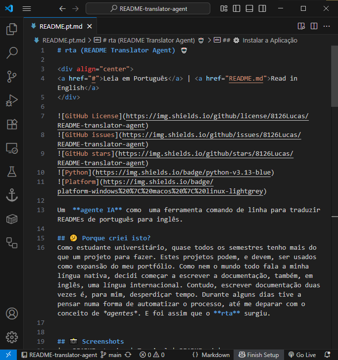
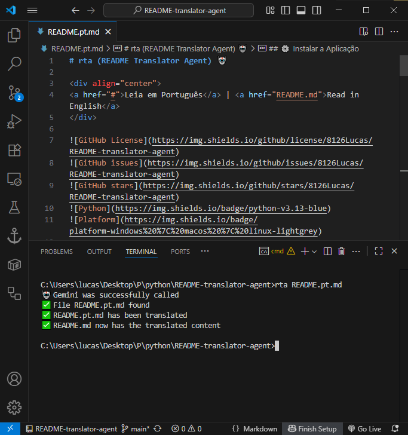

# rta (README Translator Agent) 🤖

<div align="center">
<a href="#">Leia em Português</a> | <a href="README.md">Read in English</a>
</div>


Um  **agente IA** como  uma ferramenta comando de linha para traduzir READMEs de português para inglês.

## 🤔 Porque criei isto?
Como estudante universitário, quase todos os semestres tenho mais do que um projeto para fazer. Estes projetos podem, e devem, ser usados como expansão do meu portfólio. Como nem o mundo todo fala a minha língua nativa, decidi começar a escrever a documentação, também, em inglês, uma língua internacional. Contudo, escrever documentação duas vezes é, para mim, desperdiçar tempo. Durante alguns dias tive a pensar numa forma de automatizar o processo, até me deparar com o conceito de *agentes*. E foi assim que o **rta** surgiu. 


## 📸 Screenshots
|   README.pt.md   | Terminal | README.md |
|----------------|---------------------|---------------------|
|  |  |  |

## 📱 Como Funciona
1. Escrever no ficheiro `README.pt.md`
2. Correr o comando `rta README.pt.md`
3. O ficheiro `README.md` é criado/modificado

## 😎 Quando usar o `rta`?
- Projetos universitários que queres partilhar internacionalmente
- Documentação de código open-source
- Qualquer projeto onde precisas de documentação em duas línguas

## 📝 Exemplo
**Antes (README.pt.md):**
`## 🔧 Tecnologias Utilizadas`

**Depois (README.md):**
`## 🔧 Technologies Used`

## 🔧 Tecnologias Utilizadas
- **Python 3.13**: Versão do Python utilizada
- **Gemini 2.0 Flash**: Modelo de IA para processamento de texto
- **Typer**: Biblioteca Python para criar interfaces de linha de comando
- **UV**: Gestor de pacotes Python

## ⚙️ Instalar a Aplicação
1. Clonar o repositório:
```bash
git clone https://github.com/8126Lucas/README-translator-agent.git
```
2. Verificar se o UV está instalado:
```bash
uv --version

# Caso não esteja instalado
curl -LsSf https://astral.sh/uv/install.sh | less              # macOS e Linux
powershell -c "irm https://astral.sh/uv/install.ps1 | more"    # Windows (Powershell)
pip install uv                                                 # Alternativa (PyPI)
```
3. Instalar as dependências:
```bash
uv pip install -r pyproject.toml

# Ou
uv pip compile pyproject.toml -o requirements.txt
pip install -r requirements.txt
```
4. Criar uma chave API do `Gemini 2.0 Flash` [aqui](https://aistudio.google.com/apikey)
5. Criar um ficheiro `.env` com a chave API:
```bash
GEMINI_API_KEY=...
```
6. Navegar até ao diretório `README-translator-agent`
7. Instalar o agente:
```bash
pip install -e .
```

## 📁 Estrutura do Projeto
```bash
README-translator-agent/
├── rta/
│   ├── __init__.py
│   └── main.py  
├── .env 
├── pyproject.toml
├── README.pt.md
└── README.md
```

## ⚠️ Problemas Conhecidos
- O agente ainda só traduz de português para inglês

## 🛠️ Resolução de Problemas
**Q: Posso usar outro modelo, invés do Gemini 2.0 Flash?**  
**A:** Sim. Se for um modelo Gemini, apenas é necessário trocar o nome do modelo (`model='gemini-2.0-flash-001'`). Caso seja outro modelo, será necessário outras modificações, pois a biblioteca (`from google import genai`) não será útil.

## 🤝 Como Contribuir
1. Faz um fork do projeto
2. Cria uma branch para a tua feature (`git checkout -b feature/nova-funcionalidade`)
3. Commit das tuas mudanças (`git commit -am 'Adiciona nova funcionalidade'`)
4. Push para a branch (`git push origin feature/nova-funcionalidade`)
5. Abre um Pull Request